<p align="center">
  
</p>

<p align="center">
  <a href="https://github.com/ry-ops/proxmox-mcp-server/releases"></a>
  
  <a href="https://www.python.org/downloads/"></a>
  <a href="https://modelcontextprotocol.io/"></a>
  <a href="https://github.com/ry-ops/proxmox-mcp-server/pkgs/container/proxmox-mcp-server"></a>
  <a href="LICENSE"></a>
</p>

<p align="center"><b>Talk to your Proxmox cluster.</b> A Model Context Protocol server that gives Claude, or any MCP client, the <b>whole Proxmox VE API</b>: 339 tools across VMs, containers, storage, clustering, Ceph, SDN and more.</p>

<p align="center">
  <a href="#talk">Talk to it</a> ·
  <a href="#how">How it works</a> ·
  <a href="#tools">339 tools</a> ·
  <a href="#quick-start">Quick start</a> ·
  <a href="#read-only">Read-only mode</a> ·
  <a href="#a2a">A2A</a> ·
  <a href="#troubleshooting">Troubleshooting</a>
</p>

---

## ✨ Highlights

- 🧰 **The whole API, not a demo.** 339 tools across 14 areas: nodes, QEMU VMs, LXC containers, storage and backup, cluster and HA, access control, firewall, disks, Ceph, ACME, SDN, notifications, pools and appliances.
- 🖥️ **Inside your guests too.** Run commands through the QEMU guest agent (`vm_agent_exec` → `vm_agent_exec_status`) and read back the exit code and output.
- 🔒 **Look-but-don't-touch with one switch.** `PROXMOX_READ_ONLY=true` refuses every write inside the server, and 149 read-only tools keep working.
- 🔑 **API tokens or passwords.** Tokens are recommended; pair them with a `PVEAuditor` role for monitoring.
- 🐳 **Runs anywhere.** Use `uv` from a clone, or the multi-arch image on `ghcr.io`.
- 🤝 **A2A-ready.** `agent-card.json` lists every tool in 14 skill categories, for agent-to-agent discovery.
- 🛡️ **Appliances.** `deploy_fortigate_vm` builds a FortiGate-VM from Fortinet's KVM image, with WAN/LAN NICs on the bridges and VLANs you choose.

<a id="talk"></a>

## 💬 Talk to your cluster

<p align="center">
  
</p>

Once it's connected, just ask:

> *"Can you list all VMs in my Proxmox cluster?"*
> *"What's the status of VM 100 on node pve1?"*
> *"Create a snapshot called 'backup-2025' for VM 100 on pve1."*
> *"Show me the storage usage on all nodes."*
> *"List all running tasks in the cluster."*
> *"Clone VM 9000 to a new VM called web-02 and start it."*
> *"Run `df -h` inside VM 120 using the guest agent and show me the output."*

There are more worked examples in [USAGE.md](USAGE.md).

<a id="how"></a>

## ⚙️ How it works

<p align="center">
  
</p>

- **Your MCP client** (Claude Desktop, Claude Code, or anything that speaks MCP) starts the server and talks to it over **stdio**.
- **The server** (Python, `httpx`, the MCP SDK) turns each tool call into a request to the **Proxmox VE REST API** over HTTPS on port **8006**, authenticated with an **API token** or a **password**.
- **Read-only mode** is checked in the server's HTTP client, so a refused write never leaves your machine.

<a id="tools"></a>

## 🧰 339 tools, 14 areas

<p align="center">
  
</p>

| Area | Tools | Highlights |
|------|------:|------------|
| Nodes | 38 | Status, config, DNS/hosts/time, network interfaces, services, APT updates, syslog, power |
| QEMU VMs | 46 | Lifecycle, create/clone/delete, config, snapshots, migration, disk resize/move, RRD metrics, guest agent (`vm_agent_exec`, `vm_agent_exec_status`), VNC proxy |
| LXC containers | 28 | Lifecycle, create/clone/delete, config, snapshots, migration, resize |
| Storage & backup | 14 | Storage definitions, content and volumes, URL downloads, `vzdump` backup and restore |
| Cluster | 37 | Status, resources, options, log, tasks, HA resources/groups, replication, backup jobs |
| Access control | 33 | Users, API tokens, groups, roles, ACLs, realms |
| Firewall | 31 | Cluster and node rules, security groups, aliases, IP sets, macros, logs (per-VM and per-container rules are in the guest modules) |
| Disks | 17 | SMART, wipe, GPT init, LVM, LVM-thin, ZFS, directory storage |
| Ceph | 33 | Status, OSDs, monitors, managers, MDS, pools, flags, CRUSH |
| ACME & certificates | 17 | ACME accounts and plugins, node certificate ordering, custom certs |
| SDN | 16 | Zones, VNets, subnets, apply |
| Notifications | 23 | Gotify, sendmail, SMTP and webhook endpoints, matchers |
| Pools | 5 | Resource pool CRUD |
| Appliances | 1 | `deploy_fortigate_vm`: FortiGate-VM from Fortinet's KVM image, WAN/LAN NICs on chosen bridges and VLANs, sized for the free evaluation license |

Tool names follow the Proxmox API: `list_*`, `get_*`, `create_*`, `update_*`/`set_*`, `delete_*`, plus actions such as `start_vm`, `migrate_container` or `apply_sdn`. Each area is one module in [`proxmox_mcp/tools/`](proxmox_mcp/tools/). Your MCP client shows every tool with its full input schema, or you can list them all locally:

```bash
uv run python -c "from proxmox_mcp.server import ALL_TOOLS; print('\n'.join(sorted(t.name for t in ALL_TOOLS)))"
```

### Handy recipes

| Task | Tools |
|------|-------|
| Inventory | `list_nodes`, `get_cluster_resources`, `list_vms`, `list_containers`, `list_storage` |
| VM lifecycle | `start_vm`, `shutdown_vm`, `stop_vm`, `reboot_vm`, `create_vm`, `clone_vm`, `migrate_vm` |
| Disk images | `download_url_to_storage` with `content=import`, then `create_vm` with `scsi0=local-lvm:0,import-from=local:import/<image>`, or `import_vm_disk` |
| Snapshots | `create_vm_snapshot`, `list_vm_snapshots`, `rollback_vm_snapshot`, `delete_vm_snapshot` |
| Monitoring | `get_node_status`, `get_vm_status`, `get_vm_rrddata`, `get_node_storage_status` |
| Tasks | `list_cluster_tasks`, `list_node_tasks`, `get_task_status`, `get_task_log` |
| Guest agent | `vm_agent_exec` (returns a PID), then `vm_agent_exec_status` for the exit code and output |

<a id="quick-start"></a>

## 🚀 Quick start

You need **Python 3.10+** with [`uv`](https://github.com/astral-sh/uv), or Docker, and **Proxmox VE 6.0 or later**.

**1. Make an API token.** In the Proxmox UI, go to **Datacenter → Permissions → API Tokens → Add**. For full access, uncheck *Privilege Separation* so the token inherits your user's permissions. Copy the secret; you won't see it again. The full token ID looks like `root@pam!automation`.

**2. Run the server** with one of these:

<details open>
<summary><b>uv, from a clone</b></summary>

```bash
curl -LsSf https://astral.sh/uv/install.sh | sh     # if you don't have uv
git clone https://github.com/ry-ops/proxmox-mcp-server && cd proxmox-mcp-server
./setup.sh                                          # or: uv sync

export PROXMOX_HOST="192.168.1.100"
export PROXMOX_USER="root@pam"
export PROXMOX_TOKEN_NAME="automation"
export PROXMOX_TOKEN_VALUE="your-token-here"
./test-connection.sh                                # checks connection, auth and permissions
```

A `.env` file in the project directory is loaded automatically; see [`.env.example`](.env.example).
</details>

<details>
<summary><b>Docker</b></summary>

A multi-arch image is published to GitHub Container Registry on every push to `main` and for each release tag:

```bash
docker pull ghcr.io/ry-ops/proxmox-mcp-server:latest   # or a version tag, e.g. :2.3.0
docker run -i --rm --env-file .env ghcr.io/ry-ops/proxmox-mcp-server:latest
```

MCP clients talk over stdio, so run the container interactively (`-i`). `docker-compose.yaml` does the same using your `.env`.
</details>

**3. Connect your MCP client.** For Claude Desktop, edit `~/Library/Application Support/Claude/claude_desktop_config.json` on macOS, or `%APPDATA%/Claude/claude_desktop_config.json` on Windows:

<details open>
<summary><b>uv + API token (recommended)</b></summary>

```json
{
  "mcpServers": {
    "proxmox": {
      "command": "uv",
      "args": ["--directory", "/absolute/path/to/proxmox-mcp-server", "run", "proxmox-mcp-server"],
      "env": {
        "PROXMOX_HOST": "192.168.1.100",
        "PROXMOX_USER": "root@pam",
        "PROXMOX_TOKEN_NAME": "automation",
        "PROXMOX_TOKEN_VALUE": "your-token-value-here"
      }
    }
  }
}
```
Use the **absolute** path to your clone.
</details>

<details>
<summary><b>uv + password</b></summary>

```json
{
  "mcpServers": {
    "proxmox": {
      "command": "uv",
      "args": ["--directory", "/absolute/path/to/proxmox-mcp-server", "run", "proxmox-mcp-server"],
      "env": {
        "PROXMOX_HOST": "192.168.1.100",
        "PROXMOX_USER": "root@pam",
        "PROXMOX_PASSWORD": "your-password-here"
      }
    }
  }
}
```
</details>

<details>
<summary><b>Docker</b></summary>

```json
{
  "mcpServers": {
    "proxmox": {
      "command": "docker",
      "args": ["run", "-i", "--rm",
        "-e", "PROXMOX_HOST", "-e", "PROXMOX_USER", "-e", "PROXMOX_TOKEN_NAME", "-e", "PROXMOX_TOKEN_VALUE",
        "ghcr.io/ry-ops/proxmox-mcp-server:latest"],
      "env": {
        "PROXMOX_HOST": "192.168.1.100",
        "PROXMOX_USER": "root@pam",
        "PROXMOX_TOKEN_NAME": "automation",
        "PROXMOX_TOKEN_VALUE": "your-token-value-here"
      }
    }
  }
}
```
</details>

**4. Restart your client completely** (quit it, don't just close the window), and ask it to list your VMs. More detail in [QUICKSTART.md](QUICKSTART.md) and [SETUP.md](SETUP.md).

## 🔧 Configuration

| Variable | Required | Default | What it does |
|---|:---:|---|---|
| `PROXMOX_HOST` | ✅ | | Hostname or IP, **without** scheme or port (`192.168.1.100`, not `https://192.168.1.100:8006`) |
| `PROXMOX_USER` | ✅ | | e.g. `root@pam`, `admin@pve` |
| `PROXMOX_TOKEN_NAME` + `PROXMOX_TOKEN_VALUE` | one of | | API token auth (recommended) |
| `PROXMOX_PASSWORD` | one of | | Password auth |
| `PROXMOX_PORT` | | `8006` | API port |
| `PROXMOX_VERIFY_SSL` | | `false` | Verify the server's TLS certificate |
| `PROXMOX_READ_ONLY` | | `false` | Refuse every write; see below |

<a id="read-only"></a>

## 🔒 Read-only mode and security

**`PROXMOX_READ_ONLY=true`** makes the server look-but-don't-touch. Only GET requests are sent, and every create, update, delete or action tool is refused inside the server before it reaches the network. **149 of the 339 tools are read-only and keep working.** Three read-style tools send POST requests, so they're blocked too:
- `vm_agent_ping`;
- `get_vm_vnc_proxy` and `get_vm_spice_proxy`, which create console access tickets.

The rest of the security picture:

- **For monitoring-only use, combine both locks:** `PROXMOX_READ_ONLY=true` *and* a token with the **`PVEAuditor`** role. The flag stops the server sending writes; the role makes Proxmox refuse them anyway.
- **The token's permissions are the real limit.** The server exposes destructive operations: deleting VMs, wiping disks, and running commands inside guests. Whatever the token can do, a connected AI client can ask for. Grant the minimum.
- **Prefer API tokens** over passwords. They can be revoked on their own.
- **Set `PROXMOX_VERIFY_SSL=true`** in production with valid certificates.
- **Keep credentials out of version control**, and restrict network access to the API with firewall rules.

<a id="a2a"></a>

## 🤝 Agent-to-agent (A2A)

[`agent-card.json`](agent-card.json) is this server's identity and capability manifest for other agents. It's generated from the tool registry, and lists **all 339 tools in 14 skill categories**, each with its name, description and inputs. It also covers authentication requirements and MCP protocol details.

| Category | Tools | Category | Tools |
|---|--:|---|--:|
| `node_management` | 38 | `disk_management` | 17 |
| `virtual_machine_management` | 46 | `ceph_management` | 33 |
| `container_management` | 28 | `certificate_management` | 17 |
| `storage_management` | 14 | `sdn_management` | 16 |
| `cluster_management` | 37 | `notification_management` | 23 |
| `access_control` | 33 | `pool_management` | 5 |
| `firewall_management` | 31 | `appliances` | 1 |

<details>
<summary><b>Discover the agent's skills</b></summary>

```python
import json

with open('agent-card.json') as f:
    agent_card = json.load(f)

print(f"Agent: {agent_card['name']}  Version: {agent_card['version']}")
for skill in agent_card['skills']:
    print(f"\n{skill['category']}:")
    for capability in skill['capabilities']:
        print(f"  - {capability['name']}: {capability['description']}")
```
</details>

<details>
<summary><b>Call its tools over MCP</b></summary>

```python
from mcp import ClientSession, StdioServerParameters
from mcp.client.stdio import stdio_client

server_params = StdioServerParameters(
    command="uv",
    args=["--directory", "/path/to/proxmox-mcp-server", "run", "proxmox-mcp-server"],
    env={
        "PROXMOX_HOST": "192.168.1.100",
        "PROXMOX_USER": "root@pam",
        "PROXMOX_TOKEN_NAME": "automation",
        "PROXMOX_TOKEN_VALUE": "your-token-value",
    },
)

async with stdio_client(server_params) as (read, write):
    async with ClientSession(read, write) as session:
        await session.initialize()
        tools = await session.list_tools()
        result = await session.call_tool("list_vms", arguments={})
        print(result.content)
```
</details>

<details>
<summary><b>Orchestrate it with other agents</b></summary>

```python
# Snapshot every VM, then hand off to other agents
async def backup_workflow():
    vms = await proxmox_agent.call_tool("list_vms", {})
    for vm in vms['data']:
        await proxmox_agent.call_tool("create_vm_snapshot", {
            "node": vm['node'],
            "vmid": vm['vmid'],
            "snapname": f"backup-{datetime.now():%Y%m%d-%H%M%S}",
        })
    await storage_agent.call_tool("check_capacity", {})
    await notification_agent.call_tool("send_alert", {"message": f"Backup completed: {len(vms['data'])} VMs"})
```
</details>

<a id="troubleshooting"></a>

## 🩺 Troubleshooting

<details>
<summary><b>Authentication errors</b></summary>

- Double-check the credentials and that the user has the permissions you need.
- For API tokens, make sure the token hasn't expired or been revoked.
- If the token was created with *Privilege Separation* on, give the token its own permissions, or recreate it with that option off.
</details>

<details>
<summary><b>Connection errors</b></summary>

- Check `PROXMOX_HOST` (no scheme, no port) and `PROXMOX_PORT`.
- Check you can reach the host: `curl -k https://YOUR_HOST:8006/api2/json/version`
- If `PROXMOX_VERIFY_SSL=true`, the certificate must be valid for that host.
</details>

<details>
<summary><b>Permission errors</b></summary>

The user or token needs privileges for each operation. Common ones: `VM.Monitor`, `VM.Audit`, `Datastore.Audit`, `Sys.Audit`, `VM.PowerMgmt`, `VM.Snapshot`.
</details>

<details>
<summary><b>Tools don't show up in Claude</b></summary>

- The path in the config must be **absolute**.
- The config file must be valid JSON.
- Quit Claude Desktop completely and start it again.
- Check Claude Desktop's logs. The server logs its authentication method and connection status to stderr, which shows up there.
</details>

<details>
<summary><b>Check the connection before involving Claude</b></summary>

```bash
./test-connection.sh
```

It checks the connection, the API, authentication, permission to list nodes, and access to cluster resources.
</details>

## 🛠️ Development

```bash
uv sync                          # dependencies, including dev tools
uv run proxmox-mcp-server        # run the server directly
uv run pytest                    # tests
uv run ruff check . && uv run black .
```

```
proxmox_mcp/
├── server.py        MCP server entrypoint and tool registry
├── client.py        Proxmox API client: token/password auth, read-only guard
└── tools/           one module per API area:
                     nodes, qemu, lxc, storage, cluster, access, firewall,
                     disks, ceph, acme, sdn, notifications, pools, appliances
docs/                the animations on this page
agent-card.json      A2A agent card
Dockerfile, docker-compose.yaml, setup.sh, test-connection.sh
QUICKSTART.md · SETUP.md · USAGE.md · CHANGELOG.md
```

**Dependencies:**
- **`mcp`** (>=1.0.0, <2): 2.x changed the server API and isn't supported yet.
- **`httpx`**: the async HTTP client.
- **`python-dotenv`**: loads `.env`.

## 🗺️ Roadmap

- Streamable-HTTP transport, to run the server as a network service ([#24](https://github.com/ry-ops/proxmox-mcp-server/pull/24), [#29](https://github.com/ry-ops/proxmox-mcp-server/pull/29))
- Support for `mcp` 2.x
- Automatic ticket refresh for long-running password-authenticated sessions
- A broader automated test suite

What has shipped is in [CHANGELOG.md](CHANGELOG.md).

## 🙌 Contributing

Issues and pull requests are welcome: new tools, better error handling, performance, docs, tests and bug fixes.

## 📚 Learn more

- [Proxmox VE API](https://pve.proxmox.com/wiki/Proxmox_VE_API) · [API viewer](https://pve.proxmox.com/pve-docs/api-viewer/) · [Admin guide](https://pve.proxmox.com/pve-docs/pve-admin-guide.html)
- [Model Context Protocol](https://modelcontextprotocol.io/) · [MCP servers](https://github.com/modelcontextprotocol/servers) · [uv](https://github.com/astral-sh/uv)

## License

MIT. See [LICENSE](LICENSE).

<!-- org-footer -->
---

<p align="center"><sub>Part of <a href="https://github.com/ry-ops">ry-ops</a> · building the pipes between infrastructure, automation, and observability · built by <a href="https://github.com/ry-ops">ry-ops</a></sub></p>
